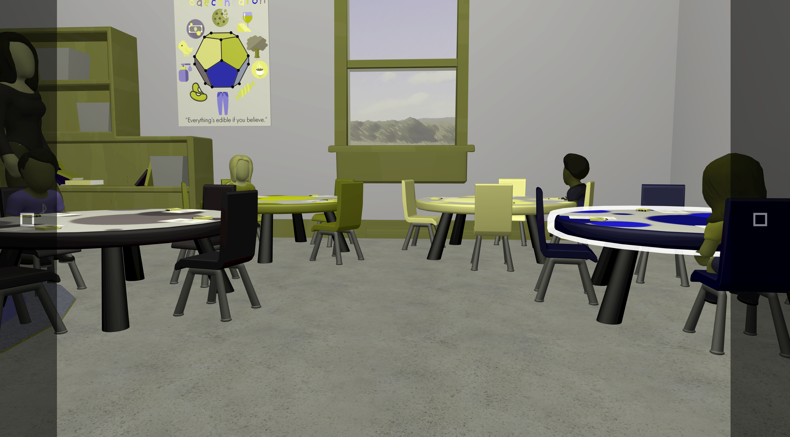
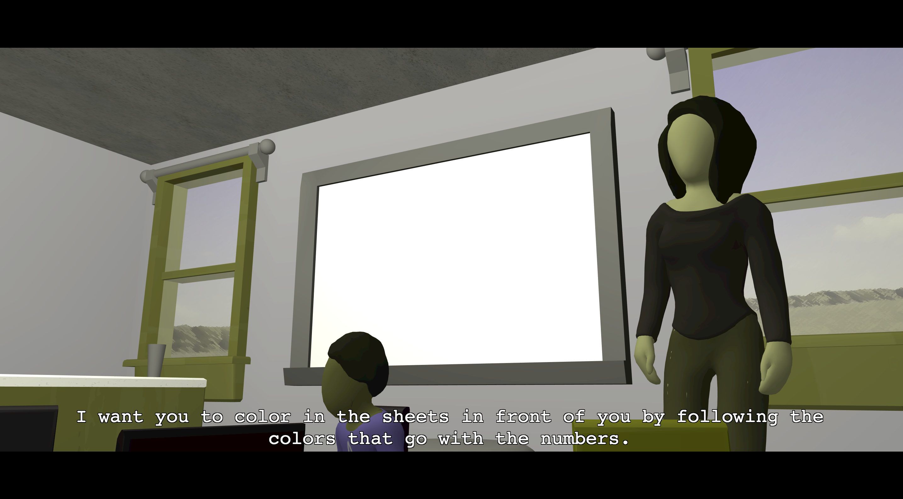
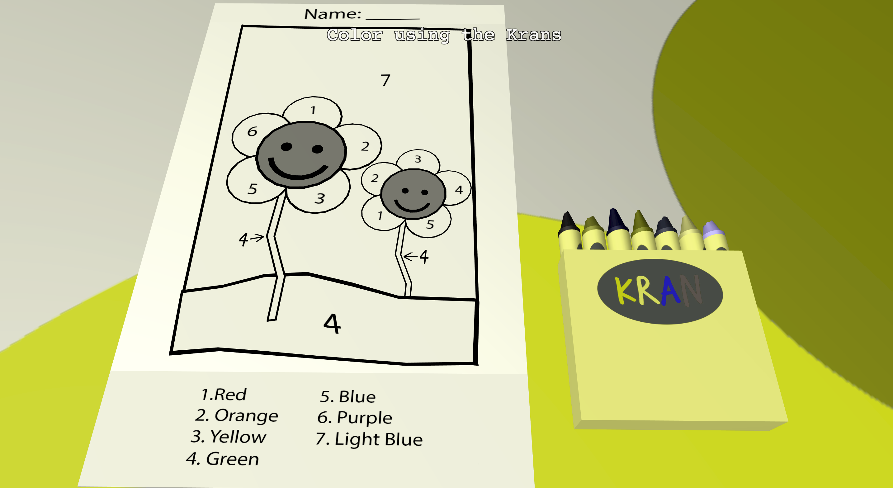

**Authors:** Alex Horton, Drew Tisdelle, Isaiah Cochran, Tommy Trieu

# How to install and play the game
1. Ensure Node.js and Google Chrome are download on your local machine.
2. Download or clone this Git repository to your local machine.
3. Open the terminal and locate the downloaded repository (.e.g. type cd \<pathname>/\<cloned repository>)
4. In that directory within the terminal, type the command `npm install` and wait for the modules to finish installing.
5. To run the game, type `npm start` in the terminal.
6. To access the game, open Google Chrome and type in the address bar `localhost:8080`. The title screen should load in the browser.
7. To play the game, press the play button on the title screen.
8. Enjoy the game!# unseeable

# Description

Unseeable is a game that takes place from the perspective of a person who is colorblind. It was developed in a custom engine with the intention of teaching those with normal color vision what it’s like to not only see the world as a colorblind person does, but to also help them gain a better understanding of the struggles that this visual impairment causes. To do this, the game takes you through real life situations that are easy for those without colorblindness, but are difficult and nearly impossible for those who have it.

Below are some screenshots taken from our game as of Thursday, March 22, 2018.

*Screenshot of Level 1 Table Selection Puzzle*

*Screenshot of Level 1 Cutscene with a view of the teacher*

*Screenshot of Level 1 Color by Number Puzzle*
